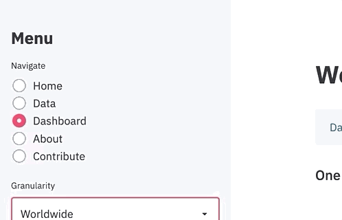
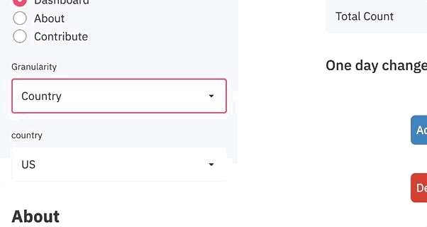

# covid-dashboard


A Coronavirus Dashboard that updates information realtime using [Streamlit](https://www.streamlit.io/) as the primary UI engine.


## Data Source

The [data source](https://github.com/CSSEGISandData/COVID-19) is the repository maintained by the Center of Systems Science and Engineering at
Johns Hopkins University. It is the same data source used to power the very famous [COVID dashboard](https://www.arcgis.com/apps/opsdashboard/index.html#/bda7594740fd40299423467b48e9ecf6)

## Overview

Streamlit offers a beautiful UI to create data apps very easily. I was able to create the
side menu just using one line of code.

```python
import streamlit as st

st.sidebar.radio("Navigate", 
                 ["Home", "Data",
                  "Dashboard", "About", 
                  "Contribute"])
```


Similarly, one can create dropdowns, checkboxes and a bunch of other UI designs.
 ```python
import streamlit as st

st.sidebar.selectbox("Granularity", ["Worldwide", "Country"])

```


The graphs were created using plotly. Since streamlit supports multiple graphical libraries, rendering plotly 
chart were very easy. Just pass the plotly figure object into the `st.plotly_chart()` function.

```python
import streamlit as st
import plotly.express as px

fig = px.bar(x=df["X"], 
             y=df["Y"])

st.plotly_chart(fig)
```


## How to run

Clone the repository and install dependencies:

```shell script
pip3 install -r requirements.txt
```

Run the app using streamlit

```shell script
streamlit run app.py
```

## Rendering Mapbox graph

In order to access the Province/State graph, you will have to create an account
on [mapbox](https://www.mapbox.com/)

Once you create an access token via mapbox do the following on your terminal:

```
mkdir src/pages/utils/tokens
```

This will create a directory called `tokens` under `utils`. Once this is done, create a file called `.mapbox_token` and paste your access token from mapbox over there.

## Contribute
Feel free to send pull requests and/or add issues.

## About

* [Linkedin](https://www.linkedin.com/in/sayarbanerjee/)
* [Website](https://www.sayar1106.github.io)
* [Github](https://github.com/Sayar1106)
* [Medium](https://medium.com/@sayarbanerjee)
* [Kaggle](https://www.kaggle.com/sayar1106)
